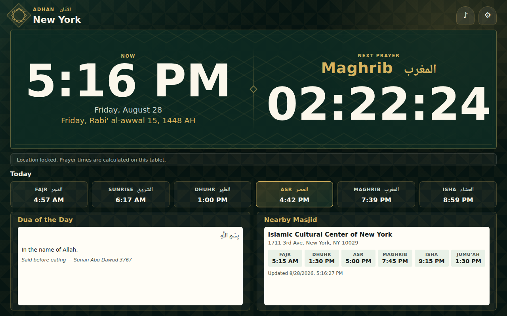

# Adhan

Static tablet kiosk web app for Islamic prayer times.



## Features

- Uses browser geolocation to calculate local prayer times entirely on-device — no external prayer-times API.
- Current time and the countdown to the next prayer are the primary display, with a compact strip of today's six prayer times below.
- Automatic light/dark theme based on time of day (light 6am–7pm, dark otherwise), with no flash on load.
- Shows both the Gregorian date and the Hijri (Islamic) date.
- Shows each prayer's Arabic name next to the English, set in Noto Naskh Arabic.
- Plays a selectable adhan recording at Fajr, Dhuhr, Asr, Maghrib, and Isha when audio is enabled, with per-prayer on/off toggles and a play/stop preview button for each reciter in Settings.
- Falls back to browser speech synthesis if the remote adhan audio is unavailable.
- Rotates a "Dua of the Day" from a built-in collection of 100 short azkar/duas (Arabic with diacritics + English translation).
- Shows the next three major Islamic occasions (Ramadan, the two Eids, Hajj/Arafah, Muharram/Ashura, Isra & Mi'raj, Islamic New Year) with Hijri date, Gregorian date, and a day countdown — computed on-device from the Umm al-Qura calendar.
- Looks up the closest masjid to your location and its iqama times using the Claude API (with web search), refreshed daily.
- Stores all preferences (calculation method, reciters, audio toggles, API key) in `localStorage` — no backend, no database.

## Local run

Open `index.html` directly, or serve it (recommended, since geolocation requires HTTPS or localhost):

```sh
python3 -m http.server 8080
```

or via the production container:

```sh
docker build -t adhan .
docker run --rm -p 8080:80 adhan
```

## Settings

Tap ⚙ to open Settings, where you can change the prayer-time calculation method, choose from 17 Sunni adhan recordings (from [praytimes.org](https://praytimes.org/docs/adhan)), preview any reciter with the ▶/■ buttons next to each dropdown, toggle which of the five daily prayers play an adhan, and set a Claude API key for the nearby-masjid lookup. Browser autoplay policies require tapping the ♪ audio button once after the kiosk page loads before any adhan can play automatically.

## Dua of the day

`azkar.js` holds 100 short azkar/duas drawn from the Qur'an and authentic hadith collections (Bukhari, Muslim, Abu Dawud, Tirmidhi, Ibn Majah — the same corpus compiled in *Hisn al-Muslim*), each with Arabic (with diacritics), an English translation, and a source reference. The app picks one deterministically by day-of-year, so it stays the same all day and rotates at local midnight. Edit `azkar.js` to add, remove, or correct entries — worth a scholar's review before relying on it for public display.

## Nearby masjid lookup

In Settings, enter a Claude API key (stored only in `localStorage`, never sent anywhere but `api.anthropic.com`). Once set and geolocation succeeds, the app asks Claude (with web search) to find the closest masjid and its iqama times, caching the result and refreshing once every 24 hours.
